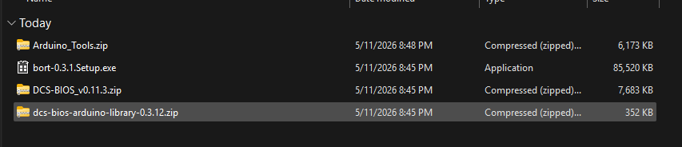

# How to install DCS-BIOS
This document will show you how to install DCS-BIOS in order to program, troubleshoot, and fly with your pit.

# Downloads
Download the most current version of DCS-BIOS, BORT, Arduino Library, and Arduino tools here. Navigate to releases then download the ZIP or .exe file 

- [DCS-BIOS](https://github.com/DCS-Skunkworks/dcs-bios)
- [BORT](https://github.com/DCS-Skunkworks/Bort)
- [Arduino Library](https://github.com/DCS-Skunkworks/dcs-bios-arduino-library)
- Arduino Tools download is available as a zip which is linked above DCS-BIOS download

 